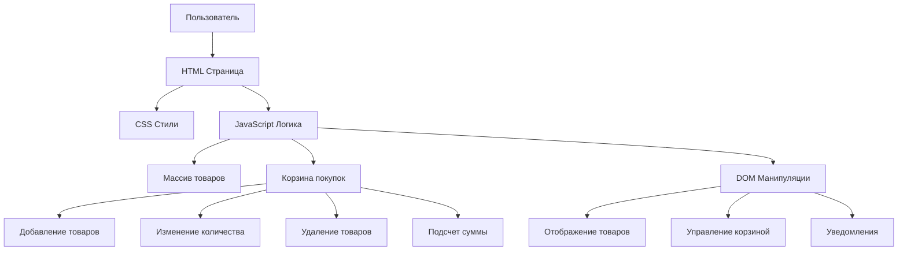
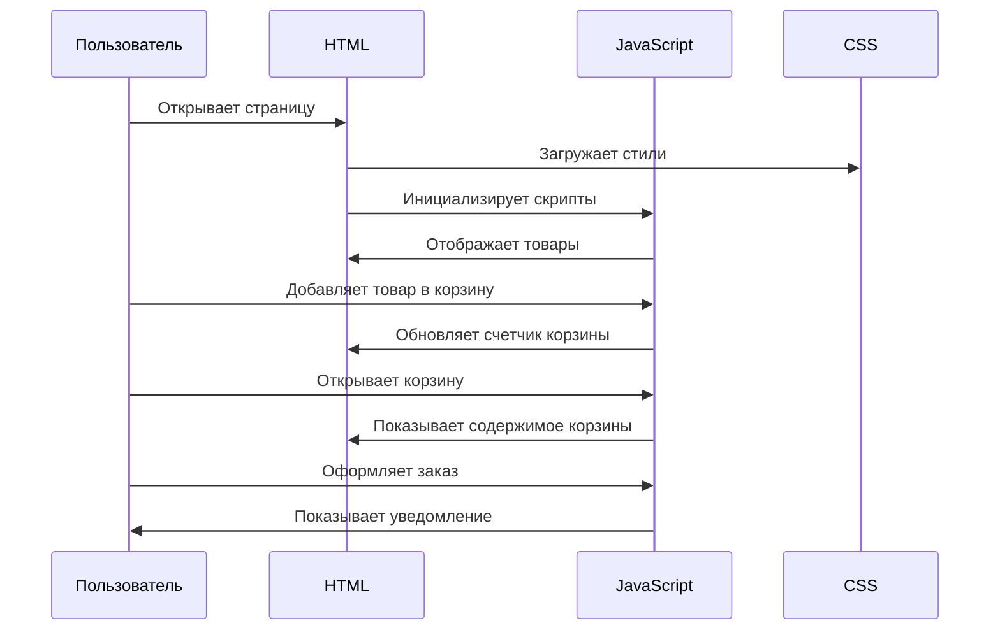
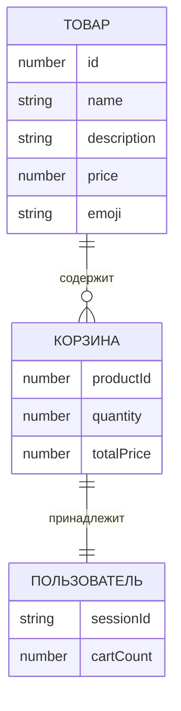

# 🛍️ MarketPlace - Интернет-магазин

Простой и функциональный интернет-магазин с корзиной покупок, созданный на чистом HTML, CSS и JavaScript.

🌐 **Демо сайта**: [https://MarlenByrd.github.io/team_work_ogyrchiki](https://MarlenByrd.github.io/team_work_ogyrchiki/)

📄 **Репозиторий**: [https://github.com/MarlenByrd/team_work_ogyrchiki.git](https://github.com/MarlenByrd/team_work_ogyrchiki.git)

## 📋 Описание

MarketPlace - это современный маркетплейс с адаптивным дизайном, позволяющий пользователям просматривать товары, добавлять их в корзину и оформлять заказы. Проект демонстрирует основные концепции веб-разработки без использования фреймворков.

## 🚀 Особенности

- **Карточки товаров** с изображениями, описаниями и ценами
- **Интерактивная корзина** покупок
- **Адаптивный дизайн** для всех устройств
- **Всплывающие уведомления** о действиях пользователя
- **Плавные анимации** и переходы
- **Полностью на чистом JavaScript** без фреймворков

## 📁 Структура проекта

```
marketplace/
├── our_site(bar).html  # Основная HTML-страница
├── maybe.css          # Стили и оформление
└── file.js           # JavaScript функциональность
```

## 🛠️ Архитектура проекта

### Диаграмма компонентов


### Диаграмма потока данных


### Структура данных


## 🛠️ Технологии

- **HTML5** - структура страницы
- **CSS3** - стилизация и анимации
- **JavaScript (ES6+)** - интерактивность и логика
- **Flexbox/Grid** - современная верстка
- **CSS Animations** - плавные переходы

## 🎯 Функциональность

### Для пользователей:
- ✅ Просмотр каталога товаров
- ✅ Добавление товаров в корзину
- ✅ Изменение количества товаров
- ✅ Удаление товаров из корзины
- ✅ Подсчет общей суммы заказа
- ✅ Оформление заказа одним кликом

### Технические особенности:
- 📱 Полностью адаптивный дизайн
- 🎨 Современный UI с градиентами
- ⚡ Оптимизированные анимации
- 📦 Легковесный код без зависимостей

## 🚀 Быстрый старт

1. **Склонируйте репозиторий:**
```bash
git clone https://github.com/MarlenByrd/team_work_ogyrchiki.git
```

2. **Откройте проект:**
```bash
cd team_work_ogyrchiki
```

3. **Запустите в браузере:**
- Откройте файл `our_site(bar).html` в любом современном браузере
- Или используйте локальный сервер:
```bash
# Python 3
python -m http.server 8000

# Node.js (если установлен http-server)
npx http-server
```

## 💻 Пример использования

```javascript
// Добавление нового товара
const newProduct = {
    id: 7,
    name: "Новый гаджет",
    description: "Инновационное устройство",
    price: 29990,
    emoji: "🔧"
};

products.push(newProduct);
displayProducts();
```

## 🎨 Кастомизация

### Изменение темы:
```css
/* В maybe.css измените градиент в header */
header {
    background: linear-gradient(135deg, #ваш-цвет1 0%, #ваш-цвет2 100%);
}
```

### Добавление товаров:
```javascript
// В file.js добавьте в массив products
{
    id: 8,
    name: "Название товара",
    description: "Описание товара",
    price: 10000,
    emoji: "🎨"
}
```

## 📱 Адаптивность

Проект полностью адаптирован для:
- 💻 Десктопов
- 📱 Смартфонов
- 📱 Планшетов

## 🔧 Совместимость

- Chrome 60+
- Firefox 55+
- Safari 12+
- Edge 79+

## 📈 Возможности для расширения

- [ ] Добавление системы авторизации
- [ ] Интеграция с платежными системами
- [ ] Поиск и фильтрация товаров
- [ ] Система отзывов
- [ ] Избранное
- [ ] История заказов

## 🤝 Вклад в проект

1. Форкните проект
2. Создайте ветку для новой функции (`git checkout -b feature/AmazingFeature`)
3. Зафиксируйте изменения (`git commit -m 'Add some AmazingFeature'`)
4. Запушьте ветку (`git push origin feature/AmazingFeature`)
5. Откройте Pull Request

## 📄 Лицензия

Этот проект лицензирован по лицензии MIT - см. файл [LICENSE.md](LICENSE.md) для подробностей.

## 🙋‍♂️ Авторы

**Бердышев Илья Маратович, Абарбанель Данила Андреевич, Изотиков Павел Алексеевич**

## 🙏 Благодарности

- Вдохновлен современными UI/UX трендами
- Создан для демонстрации веб-разработки
- Использует лучшие практики адаптивного дизайна

---

<p align="center">
  Made with ❤️ and JavaScript
</p>

---

### ⭐ Понравился проект?

Не забудьте поставить звезду репозиторию! Это помогает проекту развиваться и помогает другим найти его.
